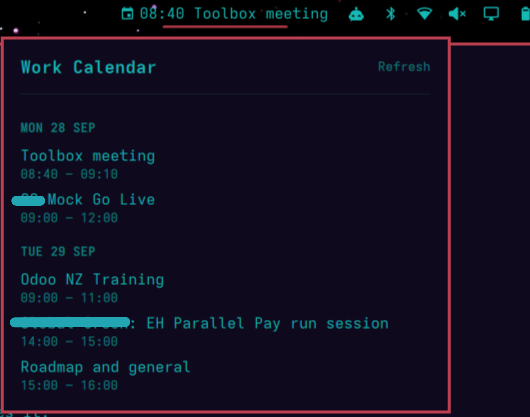

# Omarchy Work Calendar

An [Omarchy](https://omarchy.org) bar widget that shows your next calendar
event in the top bar, with a popup listing upcoming events.

- Shows the event happening now, or the next one (`09:30 Team standup`)
- Click for a popup of upcoming events grouped by day
- Middle-click to refresh
- Handles recurring meetings (daily / weekly / monthly / yearly)
- Read-only and private: it only downloads a calendar feed; nothing is sent anywhere



Built for Outlook / Office 365 "publish calendar" feeds, but it should work with
any standard `.ics` feed (Google Calendar's "secret address in iCal format", etc.).

## Install

```bash
git clone https://github.com/MrMo3/omarchy-outlook-calendar
cd omarchy-outlook-calendar
./install.sh
```

The script copies the plugin into `~/.config/omarchy/plugins/` and asks for
your calendar URL. Then add this to the `right` (or `left`) list of the bar in
`~/.config/omarchy/shell.json` and restart the shell:

```json
{ "id": "mrmoe.outlook-calendar" }
```

## Getting your calendar URL

**Outlook on the web:** Settings → Calendar → Shared calendars → *Publish a
calendar* → pick your calendar, set permissions to "Can view all details", click
Publish, and copy the **ICS** link.

> **Treat this link like a password.** Anyone with it can read your calendar.
> Never commit it to Git or post it publicly. It's stored only in
> `~/.local/state/omarchy/settings/outlook-calendar.json` (`icsUrl` key), which
> the installer makes readable by you alone. Your organisation may also block
> publishing calendars, so check with your IT admin.

## Limitations

- Timezones: events are treated as being in your machine's local timezone.
- Recurrence support covers the common meeting patterns, not every RFC 5545 rule.
- No alarms/reminders.

## Uninstall

```bash
./install.sh --uninstall
```

Then remove the entry from `shell.json`.

## License

MIT
